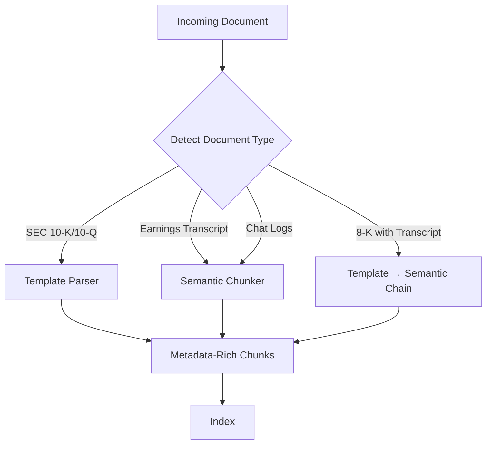
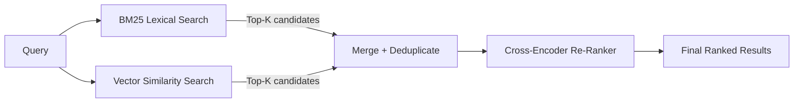
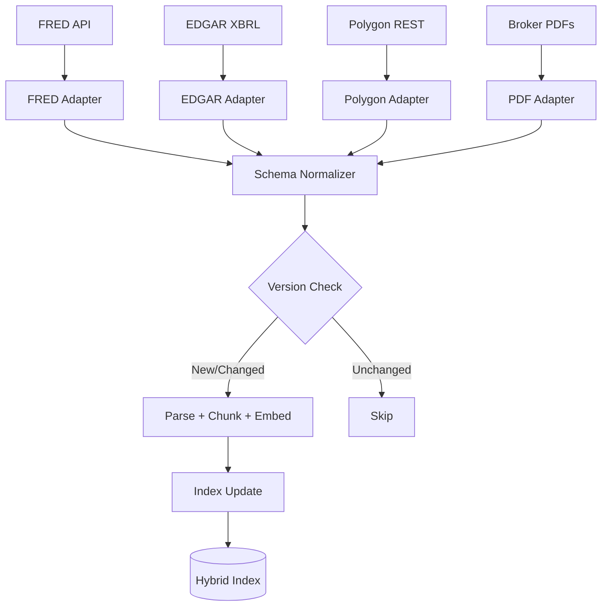
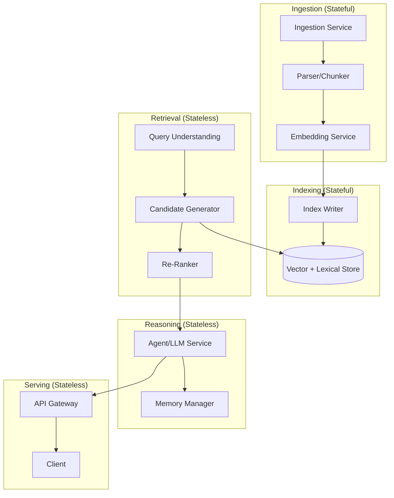

# Assignment 4: Architectural Analysis of RAGFlow

**Author:** Nile  
**Course:** AI Spring 2026  

---

## 1. Deep Document Understanding vs Naive Chunking

### Why Deep Document Understanding Outperforms Fixed-Size Chunking

Fixed-size chunking treats documents as flat token streams, splitting every N tokens regardless of content structure. Deep document understanding — as implemented by RAGFlow's DeepDoc engine — first reconstructs layout semantics (tables, headers, captions, nested lists, multi-column flows) and then chunks along recovered boundaries.

Enterprise documents encode meaning in **structure, not just text**. A table in a 10-K is a relational object where row-column position determines meaning. A fixed-size chunker that bisects a table mid-row produces a chunk where a numeric value has lost its association with its label and time period. The text is present but the semantics are destroyed.

### Retrieval Fidelity

When a query matches a chunk, retrieval fidelity measures whether that chunk contains a coherent, self-contained answer unit. Fixed-size chunking introduces three failure modes:

- **Table bisection:** A query about net interest margin retrieves a chunk containing the bottom half of an income statement — numbers without column headers. The LLM hallucinates labels or misattributes values.
- **Cross-section contamination:** A token window straddles two sections (end of Risk Factors, beginning of MD&A). The chunk conflates a forward-looking risk disclosure with backward-looking performance analysis.
- **Caption-figure separation:** A chart's caption lands in one chunk, the interpretive text in another. Neither is independently useful.

Deep document understanding avoids all three by establishing element-level boundaries before chunking. Tables become single retrieval units (or are decomposed row-by-row with headers preserved), section boundaries are respected, and captions stay attached to referents. The result is higher precision at the chunk level, fewer irrelevant chunks in the context window, and fewer hallucinations.

### Index Design

With fixed-size chunks, the index is a flat collection of text blobs — a vector and a doc ID. Deep understanding enables typed, metadata-rich indexing: chunks carry structural metadata (section path, element type, page number, parent document), enabling filtered retrieval such as "retrieve only from tables in Item 7." Table chunks can be indexed with both their embedding and a structured representation (column headers as metadata fields), supporting hybrid retrieval that combines semantic similarity with schema-aware filtering. Hierarchical indices become possible — section-level embeddings for coarse retrieval, element-level embeddings for fine-grained re-ranking.

### Preprocessing Cost

Deep document understanding is significantly more expensive: layout detection via vision models, OCR for scanned pages, and multi-modal parsing for charts are GPU-bound operations. A single PDF may take seconds to minutes through DeepDoc vs. milliseconds for a fixed-size splitter, and template/parser maintenance per document type adds engineering burden. However, the cost is **amortized** — ingestion is a write-path operation (parse once, query many times), and in enterprise RAG where corpora are relatively stable (quarterly filings, internal reports), the economics strongly favor investing in preprocessing. The failure case for deep understanding is high-velocity, ephemeral content (e.g., indexing thousands of Slack messages per hour), where lightweight chunking is appropriate.

The architectural takeaway: **retrieval quality is bounded by ingestion quality.** No amount of re-ranking or query rewriting downstream can recover semantics destroyed at the chunking stage.

---

## 2. Chunking Strategy: Template vs Semantic

### Template-Based Chunking

Template-based chunking uses predefined structural rules — regex patterns, document schemas, heading hierarchies, table boundaries — to segment documents. The chunker already "knows" the document's layout grammar (e.g., a 10-K parser splits by Item 1, Item 1A, Item 7, Item 8 boundaries). Chunks respect semantic boundaries that actually exist in the document.

### Embedding-Driven Semantic Segmentation

Semantic segmentation computes embeddings for sliding windows across the text and places chunk boundaries at cosine similarity valleys — points where embedding-space discontinuity signals a topic shift. It discovers structure from the content itself, requiring no schema.

### Failure Under Highly Structured Documents (Financial Reports)

**Semantic segmentation fails here.** Financial reports contain structure that carries meaning independent of semantic similarity. Item 1A (Risk Factors) and Item 7 (MD&A) in a 10-K often discuss the same topics — interest rate risk, credit exposure, regulatory headwinds. Embedding similarity between adjacent sections can remain high across what are legally and analytically distinct sections. The segmenter may merge them, destroying provenance boundaries critical for downstream analysis. Within table-heavy sections, embeddings of numeric data are noisy — the segmenter may fragment a table arbitrarily because row-to-row embedding similarity is unstable.

### Failure Under Loosely Structured Corpora (Chat Logs)

**Template-based chunking fails here.** Templates assume a stable, recurring structure. Chat logs have none — no heading hierarchy, no consistent section breaks, no schema. A template chunker either falls back to naive fixed-size splitting (defeating its purpose) or produces wildly inconsistent chunks. Topic drift within a thread means a single chunk can span multiple unrelated discussions.

### Architectural Implication

No single chunking strategy dominates across document heterogeneity. A production system needs a routing layer at ingestion that inspects incoming documents and dispatches to the appropriate strategy — template for structured filings, semantic for transcripts and unstructured text. Documents like 8-K filings with attached earnings transcripts require a **chained approach**: template parsing at the document level to extract item sections, then semantic chunking within sections containing unstructured content.

---

## 3. Hybrid Retrieval Architecture

### Why Hybrid Retrieval Improves Recall and Precision

Lexical (BM25) and dense retrieval have **partially overlapping but distinct recall sets.** BM25 retrieves by exact term overlap (TF-IDF weighted); dense retrieval maps queries and documents into a shared embedding space and retrieves by cosine similarity. The documents each method surfaces are not the same set.

**Recall** improves by set union: if BM25 retrieves {A, B, C} and vector retrieves {B, D, E}, hybrid considers {A, B, C, D, E}. A relevant document only needs to be captured by one method to enter the candidate pool.

**Precision** improves because the re-ranker (a cross-encoder) acts as a learned filter over the merged candidate set, scoring candidates jointly against the query. It can promote a semantically relevant result that BM25 missed and an exact-match result the embedding model underweighted.

### Lexical-Only Failure Case

**Vocabulary mismatch.** A user queries "bank profitability metrics" but the relevant chunk uses "net interest margin" and "return on equity" without the word "profitability." BM25 sees zero term overlap on the key concept and ranks this chunk low or misses it. The document answers the query but does not share its words.

### Vector-Only Failure Case

**Exact identifier lookup.** A query for a specific FRED series ID (e.g., "BUSLOANS") needs exact string matching. An embedding model has no reason to place an arbitrary series ID near its semantic description in vector space. Vector search either misses it or returns semantically similar but wrong series. Similarly, numeric precision fails — "JPMorgan Tier 1 capital ratio Q3 2025" produces an embedding nearly identical to any quarter's discussion of JPMorgan capital ratios; BM25 anchors on "Q3 2025" correctly.

### Hybrid Edge Case Failure

**Marginal relevance on both signals.** A relevant document scores moderately on both methods — ranked #12 on vector, #15 on BM25 — but the candidate generation cutoff is top-10 per method. Neither method surfaces it into the re-ranker's pool. Mitigation: increase k at candidate generation (accepting higher latency), use reciprocal rank fusion with a longer tail, or add query decomposition to generate sub-queries that surface marginal candidates.

---

## 4. Multi-Stage Retrieval Pipeline

### Why Multi-Stage Outperforms Single-Pass ANN

Single-pass ANN (approximate nearest neighbor) search trades accuracy for speed — it prunes the search space aggressively using index structures like HNSW, meaning some relevant documents are never evaluated. A multi-stage pipeline decomposes retrieval into candidate generation (high recall, low precision), re-ranking (high precision on the candidate set), and query refinement (iterative improvement).

### Recall vs Latency Trade-Off

Candidate generation uses fast but approximate methods (ANN, BM25) to produce a large, noisy set — perhaps 50-100 candidates in tens of milliseconds. The re-ranker (a cross-encoder) is expensive but accurate: it jointly encodes the query and each candidate, producing precise relevance scores. Running the cross-encoder over the full corpus would take minutes; running it over 50 candidates takes hundreds of milliseconds. The pipeline achieves near-exhaustive recall at practical latency by using cheap methods to narrow the field before applying expensive methods.

### Cascading Error Propagation

The critical failure mode: if a relevant document is not retrieved in the candidate generation stage, no amount of re-ranking recovers it. Errors cascade forward — a false negative in stage 1 is permanent. This means candidate generation must be calibrated for **high recall at the cost of precision**, with the re-ranker responsible for precision. Over-aggressive pruning in early stages (e.g., a small top-k) creates a recall ceiling that downstream stages cannot lift. The mitigation is to over-retrieve at generation time and use the re-ranker as the precision filter, monitoring recall metrics per stage to detect degradation.

---

## 5. Indexing Strategy and Storage Backends

### Design Criteria for Backend Selection

**Elasticsearch-like hybrid store** combines inverted indexes (BM25) with vector indexing in a single system. Best for workloads requiring both lexical and semantic search without operational complexity of managing two systems. Favored when the corpus has a mix of structured metadata (dates, tickers, section types) and unstructured text, and queries frequently combine keyword filters with semantic similarity. Trade-off: neither its lexical nor vector implementation is best-in-class, but the unified query interface reduces latency and operational burden.

**Vector-native DB** (e.g., Infinity, Pinecone, Milvus) is optimized for ANN search with purpose-built index structures (HNSW, IVF-PQ). Favored for workloads dominated by semantic similarity — large embedding corpora with high query throughput requirements. Trade-off: lexical search is either absent or bolted on, and metadata filtering capabilities vary. Best when retrieval is primarily embedding-based and the re-ranker handles precision.

**Graph-augmented store** overlays entity-relationship structure on the corpus. Favored for workloads requiring multi-hop reasoning — "Which companies in portfolio X have exposure to suppliers affected by EU tariffs?" requires traversing entity relationships that flat vector search cannot capture. Trade-off: graph construction is expensive (entity extraction, relation linking), and query planning over graphs is complex. Best when the retrieval task involves compositional or relational questions.

| Backend | Best Workload | Weakness |
|---|---|---|
| Elasticsearch hybrid | Mixed keyword + semantic, metadata-rich | Neither modality is best-in-class |
| Vector-native | High-throughput semantic similarity | Weak lexical, limited relational queries |
| Graph-augmented | Multi-hop, relational reasoning | Expensive construction, complex queries |

---

## 6. Query Understanding and Reformulation

### Why Query Transformation Is Critical

Users express information needs in natural language that rarely matches the vocabulary or framing of indexed documents. The **semantic gap** between query and corpus is the primary source of retrieval failure. Query transformation bridges this gap before retrieval rather than relying on the retrieval model alone.

### Static Query to Retrieval

The user's raw query goes directly to the retrieval system. This works for precise, well-specified queries ("Apple 10-K 2024 Item 1A") but fails for ambiguous, complex, or multi-faceted queries ("How is Apple managing supply chain risk in Asia?"). The retrieval system sees one query and returns one set of results, regardless of whether the query has multiple implicit sub-questions.

### Iterative Query Refinement (Agent-Driven)

An agent decomposes the original query, retrieves results for each sub-query, evaluates coverage, and reformulates to fill gaps. For the supply chain example: the agent first queries "Apple supply chain risk," evaluates the results, then issues follow-up queries like "Apple manufacturing exposure China" and "Apple supplier diversification strategy." Each iteration narrows the semantic gap.

RAGFlow's multi-turn optimization embodies this: query rewriting based on conversation context, expansion with synonyms and related terms, and decomposition of complex queries into retrievable units. The agent acts as a **closed-loop retrieval controller** — it can observe what the retrieval system returned, judge whether the information need is satisfied, and adapt its query strategy accordingly. Static retrieval is open-loop by contrast.

---

## 7. Knowledge Representation Layer

### Dense Vector Space

Documents and queries are embedded into a continuous vector space. Retrieval is nearest-neighbor search. **Compositional reasoning** is weak — vector spaces capture similarity but not logical relationships (A causes B, X is a subsidiary of Y). Adding two vectors does not produce a meaningful composition. **Retrieval explainability** is poor — cosine similarity provides a relevance score but no explanation of why two items are related.

### Relational Schema

Knowledge is stored in tables with defined schemas and foreign keys. **Compositional reasoning** is strong for structured queries — SQL joins naturally express multi-hop relationships (join company to subsidiary to supplier). **Retrieval explainability** is high — query execution plans are deterministic and auditable. However, relational schemas are rigid; unstructured text and evolving entity relationships are difficult to model without schema changes.

### Knowledge Graph

Entities and relationships are modeled as nodes and edges with typed relations. **Compositional reasoning** is strong and flexible — graph traversal handles multi-hop queries ("Which portfolio companies have suppliers in regions affected by new tariffs?") without predefined schemas. **Retrieval explainability** is high — the reasoning path is an explicit chain of edges that can be inspected. Trade-off: graph construction requires entity extraction and relation linking (expensive, error-prone), and graph query languages add complexity.

| Representation | Compositional Reasoning | Explainability | Flexibility |
|---|---|---|---|
| Dense vectors | Weak | Low | High (schema-free) |
| Relational schema | Strong (structured) | High | Low (rigid schema) |
| Knowledge graph | Strong (flexible) | High | Medium (needs entity extraction) |

---

## 8. Data Ingestion Pipeline Architecture

### Schema Normalization Across Sources

Heterogeneous sources (FRED JSON, EDGAR XML/HTML, Polygon REST, broker PDFs) must converge into a unified internal representation before indexing. The ingestion pipeline should define a **canonical document schema** — source, timestamp, entity, content type, raw text, metadata — and implement source-specific adapters that transform each format into this schema. This decouples downstream processing from source-level format changes.

### Incremental Indexing

Full re-indexing on every update is infeasible at scale. The pipeline should track document versions (hashes or timestamps) and only re-process changed or new documents. For SEC filings this is straightforward (new filings appear on known schedules); for streaming sources (market data, news), incremental indexing requires a change-data-capture mechanism or event-driven triggers.

### Consistency vs Throughput Trade-Offs

Strong consistency (every query reflects the latest ingested data) requires synchronous index updates — each document is parsed, embedded, and indexed before acknowledgment. This limits throughput. Eventual consistency (async ingestion with background index updates) maximizes throughput but creates a window where queries return stale results. For financial data with time-sensitive signals, the system should prioritize **low-latency ingestion for market-critical sources** (earnings, macro data) with eventual consistency acceptable for historical/reference documents.

---

## 9. Memory Design in RAG Systems

### Vector Memory (Semantic Recall)

Past interactions are embedded and stored in vector space. Retrieval of relevant memory is by semantic similarity to the current query. **Strength:** naturally surfaces contextually relevant past information regardless of when it occurred. **Weakness:** no temporal ordering — the system cannot distinguish between something discussed five minutes ago and five months ago. Duplicate or contradictory memories may coexist without resolution.

### Structured Memory (SQL/Graph)

Facts extracted from conversations are stored in a relational or graph database with explicit schema — entities, relationships, timestamps. **Strength:** supports precise queries ("What was the user's risk tolerance when we discussed portfolio allocation last month?"), deduplication, and contradiction resolution via schema constraints. **Weakness:** requires an extraction step to convert unstructured conversation into structured facts, which is lossy and error-prone.

### Episodic Logs (Temporal Traces)

Full conversation histories are stored chronologically as sequential records. **Strength:** preserves complete context including reasoning chains, corrections, and evolving preferences. Supports temporal reasoning ("the user changed their view on China exposure after the Q3 earnings call"). **Weakness:** grows linearly with interaction count, retrieval requires scanning or indexing over raw logs, and relevance decays unpredictably over time.

### Architectural Recommendation

A production system should layer all three: episodic logs as the source of truth, a structured memory layer that extracts and maintains key facts with timestamps and provenance, and a vector memory layer for fast semantic retrieval of relevant context. RAGFlow's evolving memory support across v0.23 and v0.24 reflects this progression — starting with basic recall and adding governance, API access, and structured management over time.

---

## 10. End-to-End System Decomposition

### Microservices Architecture

### Stateless vs Stateful Services

**Stateful:** Ingestion service (tracks document versions, deduplication state), Index writer (manages index consistency), Memory manager (maintains conversation and fact state). These require persistent storage and careful failover.

**Stateless:** Query understanding, candidate generation, re-ranking, agent/LLM service, API gateway. These process requests independently — any instance can handle any request, enabling horizontal scaling without coordination.

### Scaling Strategy Per Component

- **Ingestion:** Scale by partitioning across document sources. Parallelize parsing across workers; embedding computation is GPU-bound, so scale embedding service independently with GPU nodes.
- **Retrieval:** Horizontally scale stateless query/re-rank services behind a load balancer. The index itself scales via sharding (Elasticsearch) or replication (vector DB read replicas).
- **Reasoning:** LLM inference is the primary bottleneck. Scale with request queuing, batching, and multiple model replicas. Consider tiered models — a smaller model for simple queries, a larger model for complex reasoning.
- **Serving:** Standard horizontal scaling behind an API gateway with rate limiting.

### Failure Isolation Boundaries

Each service boundary is a failure isolation domain. Critical boundaries:

- **Ingestion failure** should not block retrieval — the system serves from the existing index while ingestion recovers. A write-ahead log ensures no documents are lost.
- **Embedding service failure** degrades ingestion but retrieval continues. Fallback: queue unparsed documents for retry.
- **LLM service failure** is the highest-impact failure. Mitigation: circuit breaker pattern with graceful degradation (return retrieval results without LLM synthesis), model fallback to a smaller/local model.
- **Index corruption** is catastrophic. Mitigation: periodic snapshots, replication, and the ability to rebuild from the ingestion source-of-truth (raw documents + metadata).

---
